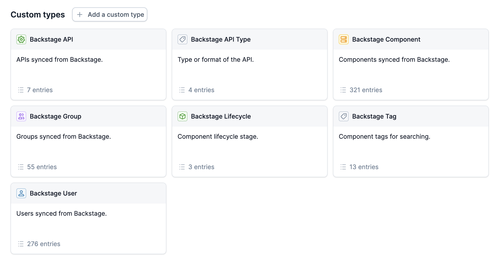

# Backstage

If you use Backstage, this configuration can be used to load `catalog-info.yaml`
and process them into incident.io catalog types.

It's recommended that you start with this config then tailor each output to
support any custom annotations you may have in your configuration.

Out the box, this will sync catalog types for:



## Sourcing from GitHub

If you want to load catalog-info.yaml files from across GitHub instead of from a
local `catalog-info.yaml` file, you can replace the `local` source to be
`github`.

This looks like:

```jsonnet
{
  github: {
    repos: [
      "example-org/example-repo",
    ],
    files: [
      "catalog-info.yaml",
    ],
  },
}
```

## Customising for your annotations

Most organisations store custom config inside annotations of Backstage catalog
types, enriching the default Backstage types for their own uses.

If you use GitHub, you might want to tag each Backstage user with their GitHub
handle, like so:

```yaml
apiVersion: backstage.io/v1alpha1
kind: User
metadata:
  annotations:
    github.com/user-login: lawrencejones
  name: lawrence
spec:
  memberOf:
    - engineering
  profile:
    displayName: Lawrence Jones
    email: lawrence@incident.io
```

If you want to load this into the incident.io catalog, you can amend the output
to add a new attribute:

```jsonnet
{
  name: 'Backstage User',
  description: 'Users syned from Backstage.',
  type_name: 'Custom["BackstageUser"]',
  source: {
    // ...
  },
  attributes: [
    // ...
    {
      id: 'github',
      name: 'GitHub',
      type: 'String',
      source: 'annotations["github.com/user-login"]',
    },
  ],
}
```
